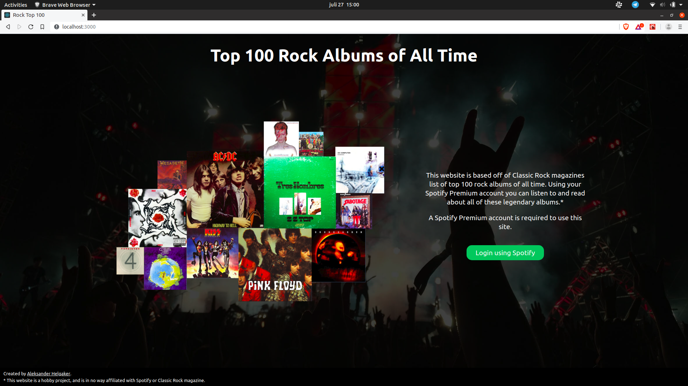
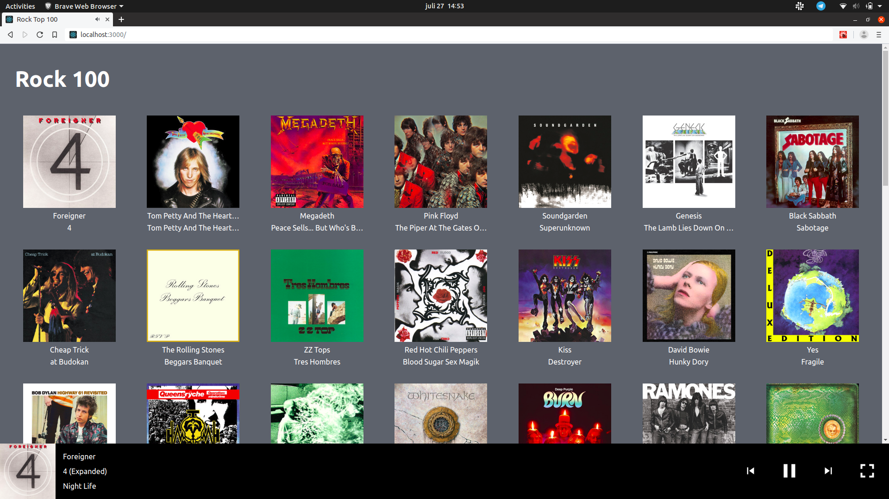
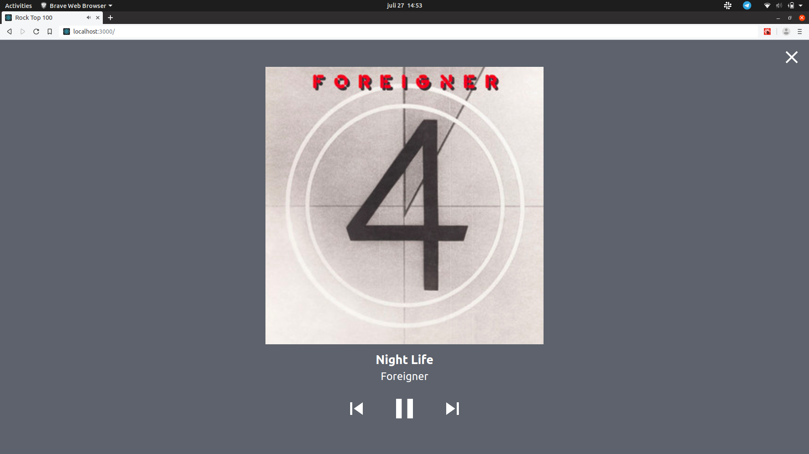

# Rock 100
## About
Rock 100 is a webapp created using React and the Spotify API. It allows you to browse and listen to music from the "Top 100 Rock Albums" list created by Classic Rock Magazine. Please not that I am in no way affiliated with Spotify or Classic Rock Magazine.

Bellow is the welcome screen for the app.

Once logged in the user is presented with the Top 100 albums.

This is the full screen view.

## Spotify Client ID
The web-app requires a spotify client id to run. The key I use is, for obvious reasons, not included in this repo. To run the code, you must edit a file called *secrets.js*.